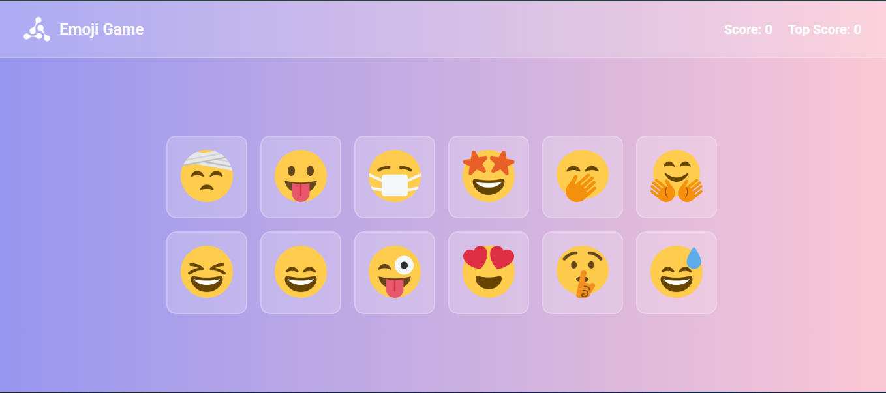
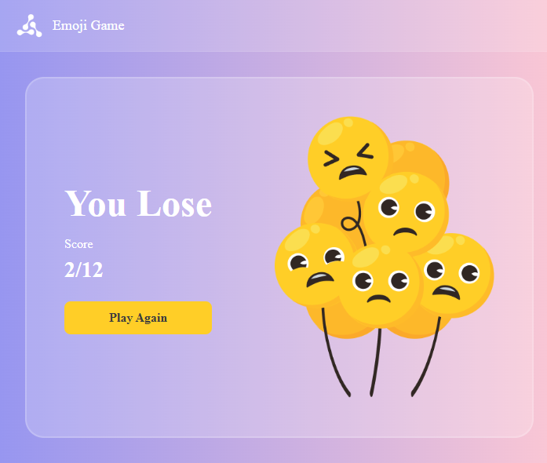

# 😄 EmojiMind

**EmojiMind** is a fun and simple memory-based emoji clicking game. Test your memory by clicking each emoji only once — click a repeated emoji and it's game over!

🔗 **Live Demo:** [emojimind.ccbp.tech](https://emojimind.ccbp.tech/)

---

## 🎮 How to Play

1. You'll see a grid of colorful emojis.
2. Click on any emoji to score a point.
3. Each time you click, the emojis shuffle/rearrange on the board.
4. Keep clicking **new** emojis you haven't clicked before to increase your score.
5. If you accidentally click an emoji you've **already clicked**, the game ends — **You Lose!**
6. Try to click all emojis without repeating to win and beat your **Top Score**.

---

## ✨ Features

- 🧠 Simple memory-based gameplay — fun and addictive
- 🎯 Live score tracker and top score (high score) tracker
- 🎨 Clean, colorful gradient UI with emoji tiles
- 🔁 "Play Again" option after losing, to retry instantly
- 📱 Responsive design for different screen sizes

---

## 🖼️ Screenshots

**Gameplay Screen**
Displays the emoji grid along with the current score and top score.



**Game Over Screen**
Shown when a duplicate emoji is clicked, displaying the final score with a "Play Again" button.



---

## 🛠️ Tech Stack

- **React.js** — Frontend framework
- **CSS** — Styling
- **JavaScript (ES6+)** — Game logic

---

## 🚀 Getting Started (Run Locally)

Clone the repository:

```
git clone https://github.com/Vishnuteja16/EmojiMind.git
```

Navigate into the project folder:

```
cd EmojiMind
```

Install dependencies:

```
npm install
```

Start the development server:

```
npm start
```

The app will run locally at:

```
http://localhost:3000
```

---

## 📂 Project Structure

```
EmojiMind/
├── public/
├── screenshots/
│   ├── gameplay.png
│   └── gameover.png
├── src/
│   ├── Components/
│   │   ├── EmojiCard/
│   │   ├── EmojiGame/
│   │   ├── NavBar/
│   │   └── WinOrLoseCard/
│   ├── App.js
│   └── index.js
├── package.json
└── README.md
```

---

## 📄 License

This project is open source and available for learning purposes.

---

### 👨‍💻 Author

Made with ❤️ by [Vishnuteja16](https://github.com/Vishnuteja16)
